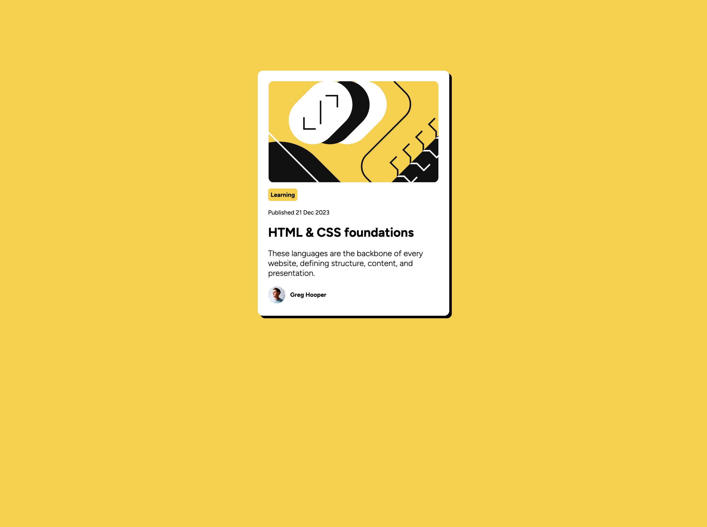

# Frontend Mentor - blog preview card solution

## Table of contents

  - [Screenshot](#screenshot)
  - [Links](#links)
- [My process](#my-process)
  - [Built with](#built-with)
  - [What I learned](#what-i-learned)

### Screenshot

### Links

- Solution URL: (https://leriwa888.github.io/blog-preview-card-main/)

## My process

I started building the container for the card, centering it, and applying margin styles to its children. Then I built the other elements from the top to bottom from the design.

### Built with

- CSS custom properties
- Flexbox
- Mobile-first workflow
- Responsive design
- [React](https://reactjs.org/) - JS library
- [Next.js](https://nextjs.org/) - React framework
- [Styled Components](https://styled-components.com/) - For styles

**Note: These are just examples. Delete this note and replace the list above with your own choices**

### What I learned

I learned to use flexbox to inline items, and space them. As well as move a div down the page vertically.
